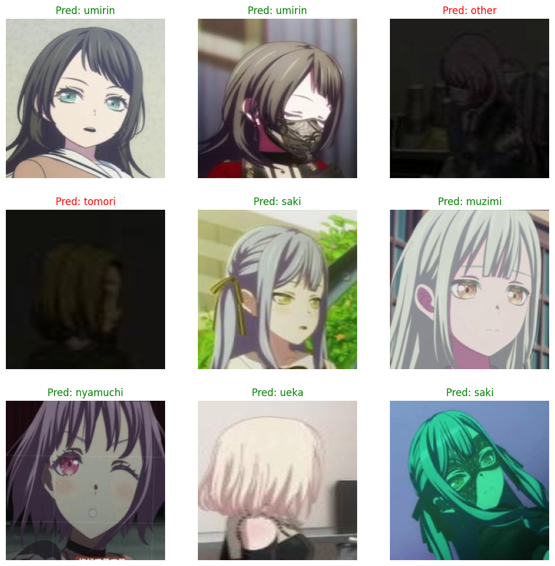
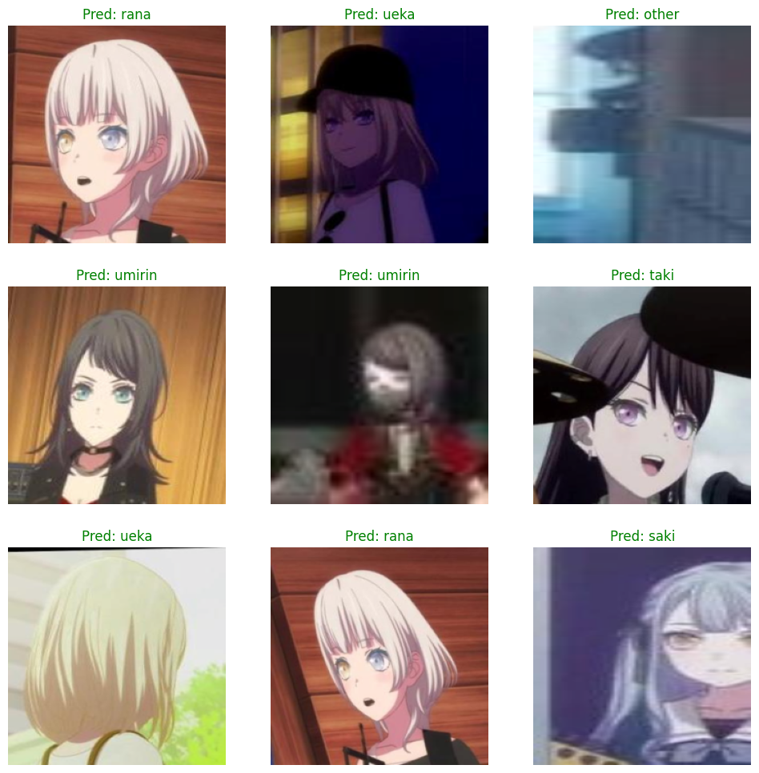

# About

This project is a personal interest piece and serves as a summary of my work over the past year. It integrates multiple technologies and techniques to create an immersive experience based on the anime series MyGo!!!!!.

The project involves extracting subtitles from the anime using OCR (Optical Character Recognition) and processing the subtitle documents through simple computer vision (CV) and data manipulation techniques. Additionally, it uses YOLO (You Only Look Once) and ResNet to identify characters in scenes and determine which character is speaking a particular line.

Finally, the system utilizes Retrieval-Augmented Generation (RAG) and Large Language Models (LLM) to complete the conversation and generate contextually accurate dialogue.

This project combines several fields such as OCR, computer vision, deep learning, and natural language processing, and it was developed as part of my personal exploration and technical growth over the past year.

# result

## YOLO result


## RESNET50 result
<div style="display: flex; justify-content: space-around;">
  
  
</div>

## LLM result

 ps: 你只是個學生...

 ps: 挺好的...

 ps: 是音樂風格不同嗎...
 
# Project Framework

- Pytorch
- PaddlePaddle
- PromptFlow
- Docker
- LangChain
- Ollama
- YOLO

# Requirements

- Python: 3.12
- CUDA Toolkit: 11.8
- PyTorch: 2.5.1+cu118
- Torchaudio: 2.5.1+cu118
- Torchvision: 0.20.1+cu118

# Environment Setup

To set up the environment, follow these steps:

1. Install PyTorch, Torchvision, and Torchaudio:

```bash
pip install torch torchvision torchaudio --index-url https://download.pytorch.org/whl/cu118
```

2. Install other dependencies from the `requirements.txt` file:

```bash
pip install -r requirements.txt
```

> **Note:**  
> If you intend to process the `src/subtitle_process_ocr` module, make sure to install `cudatoolkit==11.8`.


# Configuration

The following configuration parameters can be adjusted according to your needs. You can edit the `config.yaml` file to update the values.
Additionally, you can modify the `assets\prompts\system_prompts.jinja2`  file for more suitable prompts tailored to your LLM model.

# startup

1. pgvector init

```bash
cd pgvector
docker-compose up --build
```

2. llm server startup

you can setup the llm server with ollama or direct run with OpenAi api

```bash
ollama pull <model> //chose the model you want
ollama serve
```

3. frontend startup

```bash
streamlit run my_go_app.py
```

# other assets

Subtitle Source: [喵萌奶茶屋](https://www.nekomoe.cafe/)

Feel free to contact me to obtain the necessary asset resources.
email: quikziii@gmail.com